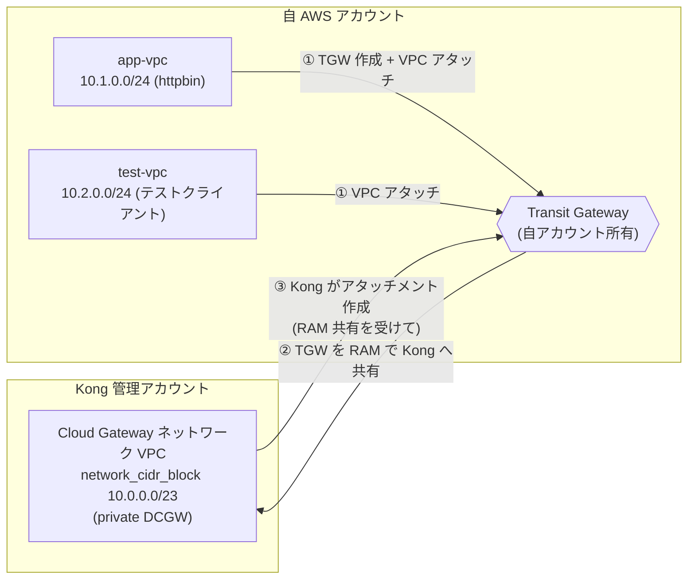

# NETWORKING — Transit Gateway 接続とルーティング

app-vpc / test-vpc と Kong Dedicated Cloud Gateway (DCGW) の Cloud Gateway ネットワークを
AWS Transit Gateway (TGW) で接続する仕組みと設定手順、確認方法をまとめます。本構成は
**閉塞ネットワーク化**を前提とし、DCGW は `api_access = private`（外部公開エンドポイント
なし）で構成します。テストは閉域網内の **test-vpc** から実行します。

## 1. 接続モデルの概要

DCGW のデータプレーンは **Kong 管理の AWS アカウント**内の VPC
（Cloud Gateway ネットワーク）で稼働します。ユーザーの app-vpc / test-vpc とは別アカウント
のため、以下の流れで TGW を介してプライベート接続します。1 つの TGW に **app-vpc と
test-vpc の両方**をアタッチします。



> **テスト経路**: `test-vpc → TGW → Kong 網 (private DCGW) → TGW → app-vpc (httpbin)`

### 役割分担

| ステップ | 実行側 | リソース / 操作 |
|---------|--------|----------------|
| Konnect: コントロールプレーン / ネットワーク / データプレーン構成 | Terraform (konnect) | `konnect_gateway_control_plane`, `konnect_cloud_gateway_network`, `konnect_cloud_gateway_configuration` |
| ① TGW 作成・app-vpc / test-vpc アタッチ・ルート | Terraform (aws) | `aws_ec2_transit_gateway`, `aws_ec2_transit_gateway_vpc_attachment` (for_each), `aws_route` |
| ② TGW を Kong アカウントへ RAM 共有 | Terraform (aws) | `aws_ram_resource_share`, `aws_ram_resource_association`, `aws_ram_principal_association` |
| ③ Kong が TGW へアタッチメント作成 | Terraform (konnect) | `konnect_cloud_gateway_transit_gateway` |
| アタッチメントの承認 | AWS（自動） | TGW の `auto_accept_shared_attachments = "enable"` により自動承認 |

> **ポイント**: 「TGW を所有・共有するのはユーザー側」「アタッチメントを作成するのは
> Kong 側」という、直感と逆向きの関係になります。本構成では TGW の
> `auto_accept_shared_attachments` を有効にしているため、Kong が作成した
> アタッチメントの手動承認は不要です。

## 2. CIDR 設計

### 2.1 定義（既定値）

| 用途 | 変数 | 既定値 | 制約 |
|------|------|--------|------|
| Kong 管理ネットワーク VPC | `network_cidr_block` | `10.0.0.0/23` | prefix は **/16〜/23**（Kong 制約）。2 AZ は最小 /23 |
| app-vpc (httpbin) | `app_vpc_cidr_block` | `10.1.0.0/24` | AWS 通常 VPC。サブネットを /26 で切り出すため 2 AZ では /24 が目安 |
| test-vpc (テストクライアント) | `test_vpc_cidr_block` | `10.2.0.0/24` | 同上 |

- 3 つの CIDR は **相互に重複してはいけません**。
- `konnect_cloud_gateway_transit_gateway.aws_transit_gateway.cidr_blocks` には
  「Kong データプレーンがルートする宛先」を渡します。本構成では **app-vpc と test-vpc の
  両 CIDR**（`[app_vpc_cidr_block, test_vpc_cidr_block]`）を渡し、Kong から app-vpc
  (upstream) への往路と test-vpc への復路の双方を成立させます。

### 2.2 Kong 側の最小 CIDR サイズ制限（根拠）

**Kong Cloud Gateway ネットワークの CIDR は prefix `/16`〜`/23` の範囲のみ許可されます。**
さらに、使用する **アベイラビリティゾーン (AZ) 数に応じて最小サイズ** が決まります。
データプレーンが各 AZ のサブネットへ分散配置され、オートスケール用の IP も確保するため、
小さすぎる CIDR（例: `/24` や `/26`）は API に拒否されます。

| AZ 数 | 最小 CIDR | 利用可能 IP |
|------|----------|------------|
| 2 | **/23** | 512 |
| 3 | /22 | 1,024 |
| 4 | /22 | 1,024 |
| 5 | /21 | 2,048 |

> 補足: `/23` ブロックは最大 3 AZ までサポート（4 AZ 以上は `/22` 以上が必要）。
> サブネットマスクは CSP 側でも最小 /28・最大 /16 の制限があります。

このため、本構成では Kong ネットワークを **`/26` ではなく許可範囲で最小の `/23`** に
設定しています。範囲外（/24 など）を指定すると Kong API に拒否されるため、
[`variables.tf`](../variables.tf) の `network_cidr_block` に **prefix /16〜/23 を強制する
バリデーション** を実装しています（誤設定を plan 時に early-fail）。

出典: [Dedicated Cloud Gateways reference — VPC CIDR 要件](https://developer.konghq.com/dedicated-cloud-gateways/reference/)

### 2.3 app-vpc / test-vpc のサブネット割当

app-vpc・test-vpc のサブネットは各 AZ の public / private を **/26** で切り出します
（`modules/app_vpc` / `modules/test_vpc` が VPC prefix から `/26` までの newbits を算出。
両モジュールとも同じ方式）。既定の `/24` + 2 AZ では以下のように `/24` を過不足なく
使い切ります（app-vpc の例。test-vpc は `10.2.x` で同じ割当）。

| サブネット | AZ | app-vpc CIDR | test-vpc CIDR | 用途 |
|-----------|----|--------------|---------------|------|
| public  | apne1-az1 | `10.1.0.0/26`   | `10.2.0.0/26`   | NAT Gateway / IGW egress |
| public  | apne1-az4 | `10.1.0.64/26`  | `10.2.0.64/26`  | NAT Gateway / IGW egress |
| private | apne1-az1 | `10.1.0.128/26` | `10.2.0.128/26` | app: ECS/内部ALB、test: クライアント |
| private | apne1-az4 | `10.1.0.192/26` | `10.2.0.192/26` | 同上 |

> AZ 数を増やす場合は各 VPC を `/24` より大きくしてください（`/24` には /26 が 4 つ
> しか入らないため、3 AZ 以上では public/private 合計が収まりません）。

## 3. ルーティング

### TGW レベル
`aws_ec2_transit_gateway` で以下を有効化しているため、app-vpc / test-vpc 両アタッチメントと
Kong 側アタッチメントが **デフォルト TGW ルートテーブルに自動関連付け・自動伝播**
されます。アタッチメント間の経路は自動で学習されます。

```hcl
default_route_table_association = "enable"
default_route_table_propagation = "enable"
auto_accept_shared_attachments  = "enable"
```

### app-vpc / test-vpc レベル
各 VPC の private ルートテーブルに、Kong ネットワーク CIDR 宛のルートを TGW 向けに
追加します（`modules/transit_gateway` の `aws_route.to_kong_network`。`vpc_attachments`
で渡した全 VPC のルートテーブルに `for_each` で適用）。

```
宛先: 10.0.0.0/23 (network_cidr_block) → ターゲット: TGW
```

> app-vpc と test-vpc の間に直接ルートは張りません。テストは必ず Kong 網（DCGW）を
> 経由します（test-vpc → DCGW → app-vpc）。

### Kong ネットワークレベル
Kong データプレーンから app-vpc (upstream) / test-vpc (復路) への戻りルートは、
`konnect_cloud_gateway_transit_gateway` に渡した `cidr_blocks`
（= `[app_vpc_cidr_block, test_vpc_cidr_block]`）に基づき Kong 側で構成されます。

## 4. Kong 管理 AWS アカウント ID（RAM 共有先）の確認

TGW を RAM 共有する Kong 管理アカウント ID は、**Konnect ネットワーク作成後**に
Konnect UI で確認します。

1. Konnect にログイン: <https://cloud.konghq.com/>
2. **Gateway Manager → Networks** を開く
3. 本構成で作成したネットワーク（`<project_name>-network`）の詳細を表示
4. Transit Gateway / アタッチメント設定欄に表示される **AWS アカウント ID** を確認

確認した ID を `.env` に設定して再 apply します。

```bash
# .env
export TF_VAR_kong_ram_principal_account_id="123456789012"
```

```bash
set -a; source .env; set +a
terraform apply
```

> この値が空の間は、`modules/transit_gateway` の RAM 共有リソースと
> `modules/konnect_dcgw` の `konnect_cloud_gateway_transit_gateway` が
> `count = 0` で作成されません。これにより「ネットワーク作成 → ID 確認 →
> 接続確立」の 2 段階 apply が成立します。

## 5. 2 段階 apply の流れ（再掲）

```bash
# 1 段階目: ネットワーク / データプレーン / テスト VPC / TGW を作成
terraform apply

# Konnect UI で Kong AWS アカウント ID を確認し .env に設定
export TF_VAR_kong_ram_principal_account_id="123456789012"
set -a; source .env; set +a

# 2 段階目: RAM 共有 + Konnect TGW アタッチメントを作成
terraform apply
```

接続状態の確認:

```bash
terraform output konnect_transit_gateway_state   # "ready" が正常
terraform output transit_gateway_id
terraform output ram_share_arn
```

`konnect_cloud_gateway_transit_gateway` の `state` は
`created → initializing → pending-acceptance → ready` と遷移します。
`pending-acceptance` から進まない場合は §7 を確認してください。

## 6. 接続確認（閉塞構成）

本構成は `api_access = private` のため、**インターネットから DCGW へはアクセスできません**
（`dcgw_public_edge_dns` / `dcgw_public_test_url` は null）。疎通は閉域網内の **test-vpc**
に置いたクライアントから、TGW 経由で DCGW のプライベートエンドポイントへリクエストして
確認します。

経路: **test-vpc (クライアント) → TGW → Kong 網 (private DCGW) → TGW → app-vpc (httpbin)**

- Kong のサービス / ルートは Terraform で作成済み（`modules/konnect_dcgw` の
  `konnect_gateway_service` / `konnect_gateway_route`、upstream = app-vpc 内部 ALB
  `app_alb_dns_name`、公開パス = `var.app_route_paths` 既定 `/echo`、`strip_path = true` +
  Service path `var.app_upstream_path` 既定 `/anything`）。**`/echo` → httpbin の `/anything`**
  へマップされ、`/anything` は受信リクエストのヘッダー等をそのまま JSON で返す
  **エコーエンドポイント**で、DCGW 通過時のヘッダー伝播の検証に使えます。
- app-vpc 内部 ALB の DNS 名は output から取得できます:

  ```bash
  terraform output app_alb_dns_name
  # 例: internal-konnect-dcgw-app-alb-xxxx.ap-northeast-1.elb.amazonaws.com
  ```

> **テストクライアントの実体（EC2 / ECS など）と、private DCGW へのリクエスト方法
> （プライベート DNS / エンドポイント）・テストケースは次ステップで決定・実装します。**
> 現時点で test-vpc は VPC・サブネット・TGW アタッチ・Kong 網へのルートまでを用意した
> 状態です（`modules/test_vpc`）。

### 疎通の切り分け
- ALB のターゲットグループのヘルスが `healthy` か（AWS コンソール / `aws elbv2 describe-target-health`）。
- app-vpc / test-vpc の private ルートテーブルに Kong CIDR → TGW のルートがあるか。
- TGW のデフォルトルートテーブルに 3 アタッチメント（app / test / Kong）が関連付け・伝播されているか。
- ALB SG が Kong ネットワーク CIDR からの該当ポートを許可しているか。

## 7. トラブルシュート

| 症状 | 確認ポイント |
|------|------------|
| `konnect_transit_gateway_state` が `pending-acceptance` のまま | TGW の `auto_accept_shared_attachments` が `enable` か。RAM 共有 (`ram_share_arn`) が Kong アカウントに正しく関連付いているか |
| RAM 共有が Kong に届かない | `aws_ram_resource_share.allow_external_principals = true` か。`kong_ram_principal_account_id` が正しいか |
| `provider account` が見つからない (`one()` エラー) | Konnect で AWS プロバイダアカウントがリンク済みか。`konnect_cloud_gateway_provider_account_list` が AWS を返すか |
| ALB ターゲットが unhealthy | ECS タスクが起動しているか（NAT 経由でイメージ取得できているか）。ヘルスチェックパス `var.app_health_check_path` が 200 を返すか |
| データプレーンが Provisioning のまま | リージョンが DCGW 対応か。`gateway_version` が有効か。Konnect の課金 / プランを確認 |

## 8. 削除時の注意

`terraform destroy` 時は依存関係上、概ね以下の順で削除されます。

1. `konnect_cloud_gateway_transit_gateway`（Kong 側アタッチメント）
2. RAM 共有（`aws_ram_*`）
3. TGW VPC アタッチメント (app / test)・ルート・TGW
4. ECS / ALB / app-vpc / test-vpc・Konnect ネットワーク / コントロールプレーン

- Kong 側アタッチメントが残っていると TGW を削除できません。先に
  `konnect_cloud_gateway_transit_gateway` が削除されることを確認してください。
- ネットワーク（`konnect_cloud_gateway_network`）はアタッチメントや構成が残っていると
  削除に失敗することがあります。エラー時は Konnect UI で残存リソースを確認してください。

## 9. 参考リンク

- [Dedicated Cloud Gateways (Kong Developer)](https://developer.konghq.com/dedicated-cloud-gateways/)
- [Networking in Konnect](https://developer.konghq.com/konnect-platform/network/)
- [Terraform provider for Konnect](https://github.com/Kong/terraform-provider-konnect)
- [AWS Transit Gateway](https://docs.aws.amazon.com/vpc/latest/tgw/what-is-transit-gateway.html)
- [AWS RAM — Transit Gateway の共有](https://docs.aws.amazon.com/vpc/latest/tgw/tgw-transit-gateways.html#tgw-sharing)
