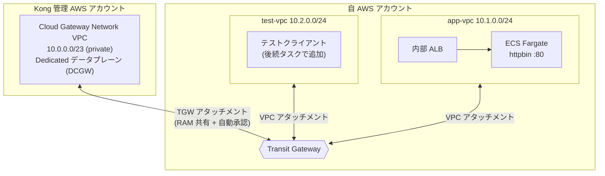
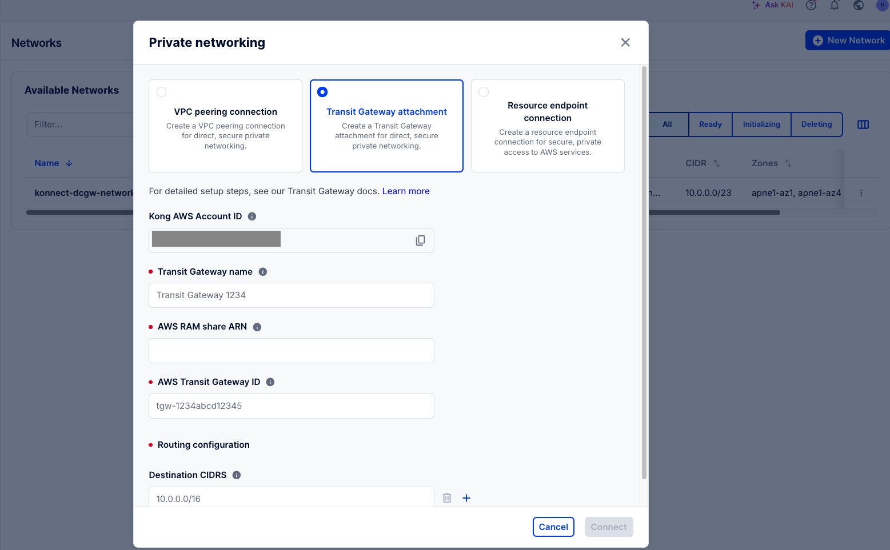
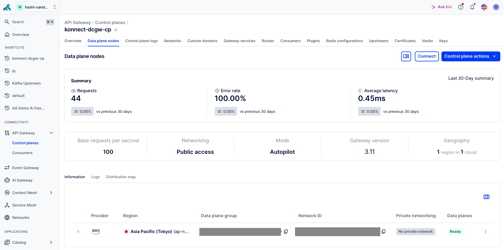

# Kong Konnect Dedicated Cloud Gateway on AWS (Terraform) — 閉塞ネットワーク構成

[Kong Konnect Dedicated Cloud Gateway (DCGW)](https://developer.konghq.com/dedicated-cloud-gateways/) を
[Terraform provider for Konnect](https://github.com/Kong/terraform-provider-konnect) で構築する環境一式です。
**環境全体を閉塞ネットワーク化**し、DCGW は `api_access = private`（外部公開エンドポイントなし）で
構成します。アプリ (httpbin) を配置する **app-vpc** と、閉域網内からテストを実行する **test-vpc** を
AWS Transit Gateway 経由で DCGW に接続します。

## 全体構成



> **テスト経路**: `test-vpc → TGW → Kong 網 (private DCGW) → TGW → app-vpc (httpbin)`
> （DCGW は `private` のため外部公開なし。閉域網内の test-vpc から疎通する）

- **Konnect 側 (`modules/konnect_dcgw`)**: コントロールプレーン、Cloud Gateway ネットワーク、
  データプレーン構成（`api_access = private`）、Transit Gateway アタッチメントを管理。
- **app-vpc (`modules/app_vpc`)**: httpbin を ECS Fargate で起動し内部 ALB の背後に配置。
  イメージは `var.app_image` で差し替え可能。
- **test-vpc (`modules/test_vpc`)**: 閉域網内からテストを実行するクライアント用 VPC（現状は
  ネットワークのみ。テストクライアント本体・テスト実行方法は次ステップで決定・追加）。
- **Transit Gateway (`modules/transit_gateway`)**: 自 AWS アカウントに TGW を作成し、app-vpc /
  test-vpc の両方をアタッチ。TGW を AWS RAM で Kong 管理アカウントへ共有し、Kong 側
  アタッチメントを自動承認。

関連ドキュメント:
- [PREREQUISITES.md](./PREREQUISITES.md) — 事前準備、必要権限、app-vpc / test-vpc の説明。
- [NETWORKING.md](./NETWORKING.md) — TGW / RAM / ルーティングの詳細と接続確認手順。
- [TESTING.md](./TESTING.md) — 疎通 / 負荷テスト（ECS タスク）の実行方法。

## ディレクトリ構成

```
.
├── README.md / PREREQUISITES.md / NETWORKING.md / TESTING.md
├── .env.example                 # 認証情報のテンプレート (コピーして .env を作成)
├── versions.tf                  # Terraform / provider バージョン制約・backend
├── providers.tf                 # aws / konnect プロバイダ設定
├── variables.tf                 # 入力変数
├── terraform.tfvars.example     # 変数の上書き例
├── main.tf                      # モジュール結線
├── outputs.tf                   # 出力
└── modules/
    ├── konnect_dcgw/            # Konnect: CP / ネットワーク / 構成 (private) / TGW
    ├── app_vpc/                 # app-vpc: ECS Fargate (httpbin) + 内部 ALB
    ├── test_vpc/                # test-vpc: テスト実行用 VPC (ネットワークのみ)
    ├── test_tasks/              # test-vpc で実行するテスト ECS タスク (疎通 / 負荷)
    └── transit_gateway/         # TGW + RAM 共有 + app/test VPC アタッチ + ルート
```

## 必要なもの

- Terraform >= 1.5
- AWS アカウントと認証情報 (詳細は [PREREQUISITES.md](./PREREQUISITES.md))
- Kong Konnect アカウントと Personal Access Token
- 対象 AWS リージョンでの DCGW 利用可否を確認（既定: `ap-northeast-1`。
  利用不可の場合は `aws_region` / `availability_zone_ids` を変更）

## セットアップ手順

### 1. 認証情報の設定

AWS は **IAM Identity Center (AWS SSO)** のプロファイルを使用します。

```bash
# 初回のみ: SSO プロファイルを設定 (start URL / リージョン / アカウント・ロール / プロファイル名)
aws configure sso            # 例: profile name = konnect-dcgw

cp .env.example .env
# .env を編集: AWS_PROFILE に上で付けたプロファイル名、Konnect の KONNECT_TOKEN 等を設定
set -a; source .env; set +a

# 作業のたびにログイン (トークン期限切れ時も再実行)
aws sso login --profile "$AWS_PROFILE"

# 認証確認 (アカウント ID が返れば OK)
aws sts get-caller-identity
```

必要に応じて変数を上書き:

```bash
cp terraform.tfvars.example terraform.tfvars
# terraform.tfvars を編集 (任意)
```

### 2. 初期化

```bash
terraform init
```

### 3. 1 段階目の apply（ネットワーク作成まで）

TGW を RAM 共有する Kong 管理 AWS アカウント ID は、Konnect ネットワーク作成後に
Konnect UI で確認します。初回はその ID を空のまま apply します（RAM 共有と
Konnect TGW アタッチメントは自動的にスキップされます）。

```bash
terraform apply
```

> `kong_ram_principal_account_id` が空のため、テスト VPC・TGW・Konnect の
> ネットワーク/データプレーンまでが作成されます。

### 4. Kong AWS アカウント ID を確認して設定

Konnect UI で確認します（手順は [NETWORKING.md](./NETWORKING.md) 参照）:



Configure private networkingのメニュー画面から、Transit Gateway attachmentを選択するとKong AWS Account IDが表示されます。このアカウント ID を `.env` に設定し直します:

```bash
# .env
export TF_VAR_kong_ram_principal_account_id="123456789012"
```

Konnect UI側からKonnect側の状況を確認します。

上記Network、並びにData Plane Nodeの状態が```ready```になった事を確認の上、次のステップに移ります。

```bash
set -a; source .env; set +a
```

### 5. 2 段階目の apply（TGW 接続を確立）

```bash
# SSO トークンが失効していれば再ログイン
aws sso login --profile "$AWS_PROFILE"

terraform apply
```

RAM 共有と `konnect_cloud_gateway_transit_gateway` が作成され、Kong 側からの
アタッチメントが自動承認されます。`terraform output konnect_transit_gateway_state`
が `ready` になれば接続完了です。

### 6. 接続確認（閉塞構成）

本構成は `api_access = private` のため、**インターネットからは DCGW へアクセスできません**。
疎通は閉域網内の **test-vpc** に置いたクライアントから、TGW 経由で DCGW のプライベート
エンドポイントへリクエストして確認します。

経路: **test-vpc → TGW → Kong 網 (private DCGW) → TGW → app-vpc (httpbin)**

httpbin を公開する Kong Service / Route は Terraform で作成済みです。**公開パスは
`var.app_route_paths`（既定 `/echo`）**で、`strip_path = true` + Service path
`var.app_upstream_path`（既定 `/anything`）により **`/echo` → httpbin の `/anything`** へ
マップされます。`/anything` は受信リクエストのヘッダー・メソッド・ボディ等をそのまま
JSON で返す **エコーエンドポイント**で、DCGW を通過する際のヘッダー伝播の確認に使えます
（例: `GET /echo` → upstream `GET /anything`）。

テストは **test-vpc 内の ECS Fargate タスク**として実行します。管理者が **ECS コンソールの
「タスクを実行」**から起動し、回数・接続先などは環境変数で上書きできます。

- **疎通テスト**（`<project>-test-connectivity`）: Kong 経由で app へ指定回数リクエストし
  HTTP ステータスを集計。
- **負荷テスト**（`<project>-test-load`, Locust）: 同時接続数（最大 1000）と実行時間
  （5分〜最長 30分）を指定して継続実行。

手順・パラメータ・必要な `terraform output` は [TESTING.md](./TESTING.md) を参照してください。

## クリーンアップ

```bash
terraform destroy
```

> TGW アタッチメントや RAM 共有が残っていると削除が滞ることがあります。
> 詳細は [NETWORKING.md](./NETWORKING.md) の「削除時の注意」を参照してください。

## 注意事項

- 本構成はローカル state を使用します。チーム運用では `versions.tf` の S3 backend
  を有効化してください。
- DCGW のデータプレーン稼働には Konnect の課金が発生します。検証後は `destroy` を推奨します。
- 秘匿情報 (`.env`, `terraform.tfvars`, `*.tfstate`) は `.gitignore` 済みです。コミットしないでください。
